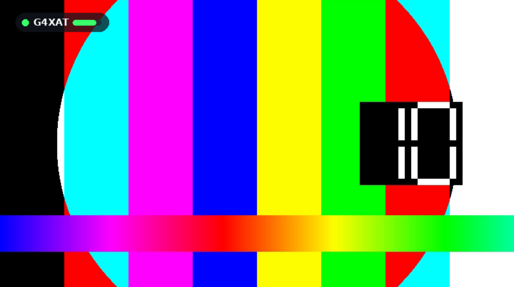

# Lynx DVB-T2 Receiver

> **Tested on the Raspberry Pi Zero W v1.1 only.** Other boards have not been
> tried yet - reports welcome.

**A low-cost DVB-T2 receiver for Amateur Television.** A Raspberry Pi and the
£20 Raspberry Pi TV HAT, straight to HDMI: it boots into a working receiver,
locks in about two seconds, and puts a Lynx-style on-screen display over the
picture. It deliberately supports **1.35, 1.7 and 2.0 MHz** channels, narrow
enough for 70cm and chosen to work with the transmitters and receivers
amateurs already have.

## Why
New licensees usually have a simple vertical, not a beam, and a path full of
reflections. DVB-T2 was built for exactly that: LDPC coding, rotated
constellations and time interleaving keep the picture solid through multipath
and flutter. In testing, waving the transmit antenna about didn't cost a single
frame. Pair this receiver with a Portsdown 4 (DVB-T2 option) and a newcomer is
on digital ATV for very little.

## Features
* **Boots straight into the receiver** - no desktop, no login. A status page
  while tuning, picture and sound as soon as it locks, and it retunes by itself
  if the signal goes.
* **Lynx-style OSD** - callsign (read from the transmitted service name),
  preset, frequency, bandwidth, the transmitted mode (constellation, code rate,
  guard interval, FFT), C/N with margin, signal level, TS rate, video and audio.
  Full panel for 15 s on lock or preset change, then a small callsign badge.
* **Your TV's remote over HDMI-CEC** - up/down the preset list, 0-9 direct,
  OK for the OSD, and **Red to tune**: type a frequency on the keypad, pick the
  bandwidth, then store it in a preset. No keyboard, no SSH.
* **HDMI identification** - appears on the TV as *Lynx DVB-T2 Rx* and switches
  the TV to itself at start-up.
* **Nine presets**, each with its own frequency and bandwidth, editable from
  the remote, the web page or a text file.
* **Web page and webhooks** on port 8080 - status, presets and tuning from a
  phone, and plain URLs (`/status`, `/preset/3`, `/tune?freq=&bw=`,
  `/save?slot=&name=`) for Home Assistant, Node-RED or `curl`.
* **Updates itself** from GitHub, like a TV: it checks at boot and daily, shows
  what's waiting on screen, and installs only when nothing is being received.
* **Hardware H.264 decoding**, and the right picture shape on any monitor.

## Screens
Rendered by the receiver's own code.

| | |
|---|---|
|  |  |
| **Searching** - signal found, not locked yet | **Locked** - waiting for the first picture |
|  |  |
| **Full OSD** - for 15 s after lock or a preset change | **Callsign badge** - the rest of the time |

## Hardware
| Item | Notes |
|---|---|
| Raspberry Pi **Zero W v1.1** | **The only board tested.** Other Pis with a hardware H.264 decoder (Zero 2 W, Pi 3, Pi 4) have not been tried. The Pi 5 won't work: it has no hardware H.264 decoder. |
| Raspberry Pi **TV HAT** | Sony CXD2880 DVB-T/T2 tuner. Needs the Pi's 40-pin header fitted (Zero WH, or solder one on). |
| microSD card | 8 GB or larger. |
| Power supply | Good quality 5 V micro-USB, 2.5 A recommended. |
| Heatsink | A small low-profile one on the Pi's chip is recommended: the TV HAT sits over it. |
| mini-HDMI to HDMI lead or adapter | For the Zero. |
| TV or monitor | HDMI. HDMI-CEC for remote control (most TVs; often called Anynet+, Bravia Sync, SimpLink, Viera Link). |
| 70cm antenna | A simple vertical is fine; a masthead preamp helps for weak signals. |
| A DVB-T2 transmitter | e.g. Portsdown 4 with the DVB-T2 option (tested with a LimeSDR Mini). |

## Bandwidths
| Setting | Occupied | Needs | Notes |
|---|---|---|---|
| **1700 kHz** | 1.54 MHz | stock driver | Standard DVB-T2 1.7 MHz. The default. Also received by the Ryde. |
| **2000 kHz** | 1.90 MHz | patched driver | Most capacity. Also received by the Knucker (Portsdown and Ryde). |
| **1350 kHz** | 1.28 MHz | patched driver | The narrowest the TV HAT can do. |

The patched driver (in `driver/`, installed with DKMS so kernel updates rebuild
it) is only needed for 1350 and 2000. The [Technical Guide](docs/TECHNICAL.md)
explains why DVB-T2 only, why these three bandwidths, and how the TV HAT was
persuaded to receive the non-standard ones.

## Quick start
    git clone https://github.com/G8YTZ/Lynx-DVB-T2-Rx.git
    cd Lynx-DVB-T2-Rx
    ./install.sh                  # receiver, service, boot to receiver
    driver/install_driver.sh      # optional: 1350 and 2000 kHz
    sudo reboot

Full instructions, including tuning from the remote and the webhook URLs:
**[Install Guide](docs/INSTALL.md)**.
How it works: **[Technical Guide](docs/TECHNICAL.md)**.

## Status
Version 1.8. Tested on a Raspberry Pi Zero W v1.1 with Raspberry Pi OS Lite
(32-bit), receiving a Portsdown 4 (DVB-T2, LimeSDR Mini) on 436 MHz at 1.7 MHz,
QPSK 1/2. Reports from other boards are very welcome.

## Licence
GPLv3 (see `LICENSE`). The patched Sony CXD2880 driver in `driver/` is derived
from the Linux kernel and is GPL-2.0 (see `driver/LICENSE`).

Justin G8YTZ. Part of the Lynx family of DATV receivers.
