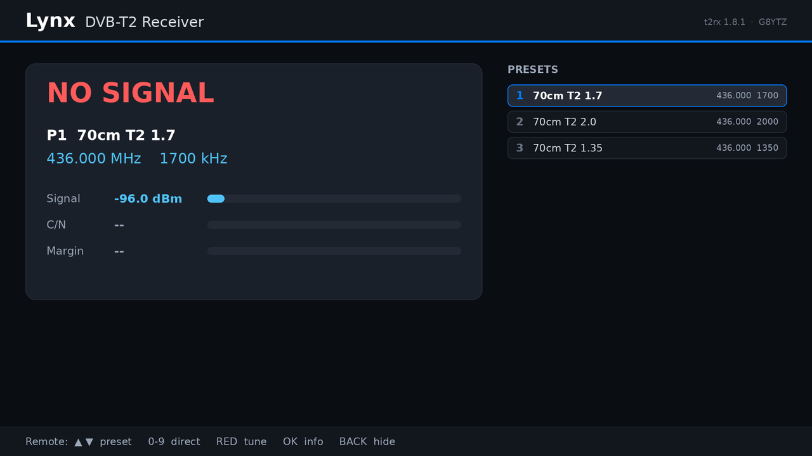
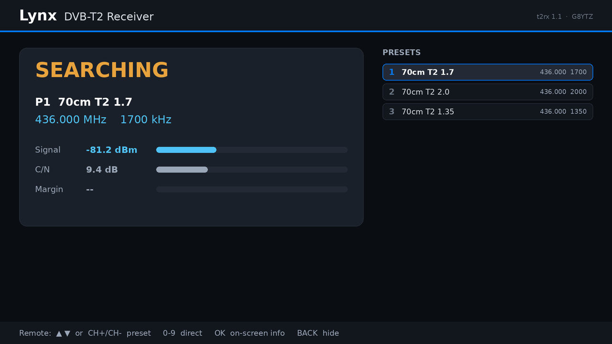
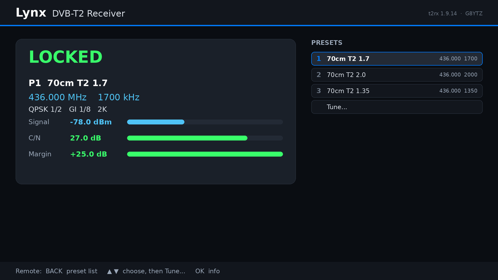
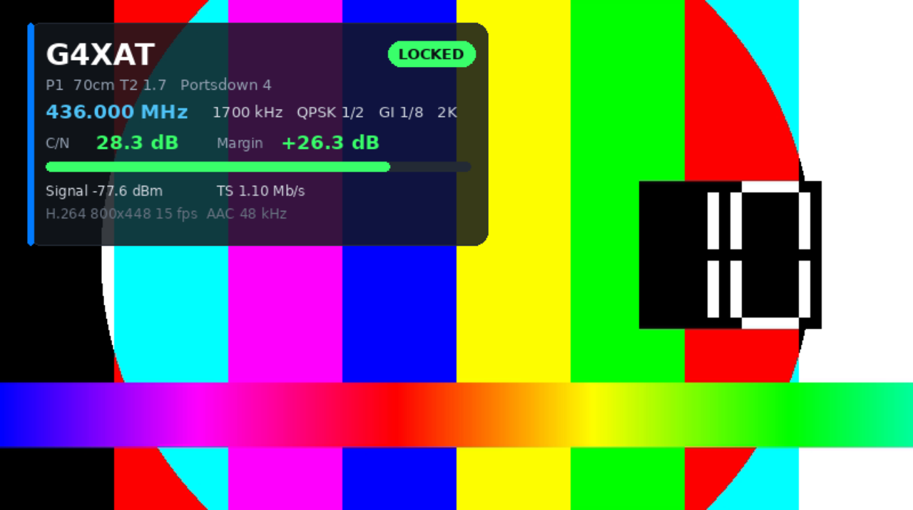
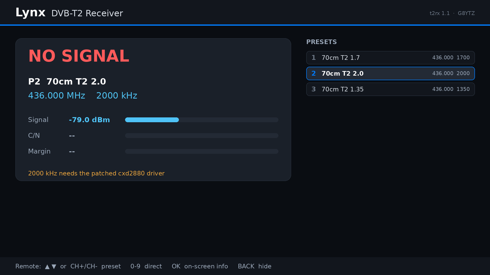

# Install Guide - Lynx DVB-T2 Receiver

From a bare Raspberry Pi to a receiver that boots into a picture. Allow about
an hour on a Pi Zero, most of it waiting for downloads and builds.

> **Tested on the Raspberry Pi Zero W v1.1 only.** These steps have not been
> tried on any other board.

## 1. Hardware
1. Fit the **TV HAT** to the Pi's 40-pin header. A Zero needs a header: buy a
   Zero WH or solder one on.
2. Connect the **70cm antenna** to the HAT's aerial input.
3. Connect the Pi to the TV or monitor with **HDMI** (mini-HDMI on a Zero).
4. Don't power up yet.

## 2. Operating system
1. In **Raspberry Pi Imager** choose your board, then
   **Raspberry Pi OS Lite (32-bit)**. Lite has no desktop, which is what we want.
2. In Imager's settings (the cog / *Edit settings*): set the hostname (e.g.
   `lynx-t2`), user `pi` and a password, your Wi-Fi, and **enable SSH**.
3. Write the card, fit it, power up, and give it a few minutes for the first boot.
4. Log in over SSH (`ssh pi@lynx-t2.local`) and bring it up to date:

       sudo apt update && sudo apt full-upgrade -y && sudo reboot

5. After the reboot, check the Pi has found the HAT:

       ls /dev/dvb/adapter0

   You should see `demux0  dvr0  frontend0  net0`. If not, check the HAT is
   seated properly and reboot.

## 3. Install the receiver
    sudo apt install -y git
    git clone https://github.com/G8YTZ/Lynx-DVB-T2-Rx.git
    cd Lynx-DVB-T2-Rx
    ./install.sh

The installer fetches the packages it needs (GStreamer, Python, fonts, CEC
tools), builds the tuner program, installs everything under `/opt/t2rx`, sets
the Pi to boot to the receiver rather than a desktop, and starts it. It ends
with a checklist:

    TV HAT: found
    Patched driver: not installed - 1700 kHz only ...
    Hardware H.264 decoder: OK
    HDMI-CEC: OK

The receiver is now running. At **1700 kHz** it works with the stock driver,
so you can test straight away (section 6).

## 4. Optional: 1350 and 2000 kHz
These two bandwidths need a patched TV HAT driver. It installs through DKMS,
so it's rebuilt automatically whenever the kernel is updated:

    driver/install_driver.sh
    sudo reboot

This takes about **15 minutes** on a Pi Zero. Afterwards `install.sh`'s
checklist (or `ls /sys/module/cxd2880/parameters/`) shows the patched driver.
It behaves exactly like the stock driver until the receiver asks for 1350 or
2000.

## 5. Presets
Edit `/etc/t2rx/presets.conf` (up to nine):

    [1]
    name = 70cm T2 1.7
    freq = 436.000
    bw = 1700

`freq` is in MHz, `bw` in kHz (1350, 1700 or 2000). Then apply them:

    sudo t2rx-ctl reload

Other settings are in `/etc/t2rx/t2rx.conf`: HDMI audio device (or `none`),
OSD mode (`auto`, `full`, `mini`, `off`) and timeout, the name the TV shows,
whether to switch the TV over at start-up, and `osd_plane` (leave on `auto`).

## 6. First test
Set the transmitter to match preset 1. For a Portsdown 4 with the DVB-T2
option: **DVB-T Parameters menu -> DVB-T2**, symbol rate **1700**, QPSK,
FEC 1/2, guard 1/8, 436 MHz, H.264 video. A keyframe every 1-2 seconds gives
the quickest picture after lock.

On the receiver's screen you should see the status page go from
**NO SIGNAL** to **SEARCHING** to **LOCKED**, then the picture with the OSD.

| | | |
|---|---|---|
|  |  |  |
| No signal | Searching | Locked |

From SSH:

    t2rx-ctl status            # everything the receiver knows
    tail -f /var/log/t2rx.log  # what it's doing

> **1700 and 1614 are the same channel.** Standard "1.7 MHz" DVB-T2 is often
> quoted as 1614 kHz (see the Technical Guide, section 3). On this receiver and
> on the Portsdown DVB-T2 option, choose **1700**; on equipment that labels it
> 1614 (such as the Ryde's notes), 1614 is the same signal.

## 7. The TV remote
| Key | Action |
|---|---|
| Up / Down | move up / down the on-screen preset list |
| CH+ / CH- | next / previous preset by number |
| 0-9 | preset by number |
| Red (or Menu) | tune to a new frequency, and store it |
| OK or Info | OSD: full -> badge -> off (installs a waiting update when there is no picture) |
| Back / Exit | hide the OSD |

If the keys don't reach the receiver, turn on the TV's HDMI-CEC control
(Anynet+, Bravia Sync, SimpLink, Viera Link, ...). The receiver appears in the
TV's input list as **Lynx DVB-T2 Rx**.

## 7a. Tuning from the remote
Press **Red** (or **Menu**). Type the frequency on the keypad - `437250` is
437.250 MHz - using **Up/Down** to pick 1350 / 1700 / 2000 kHz, then **OK** to
tune. The receiver then offers to store it: press **1-9** to put it in that
preset, or **BACK** to keep it only until you change channel. **BACK** also
deletes digits, and leaves the panel when the entry is empty.

## 7b. The web page
Open **http://<receiver>:8080/** on a phone or PC on the same network: status,
presets, tuning, and storing or deleting presets. There is no password, so
leave it on your own network (`web = off` in `t2rx.conf` disables it).

Anything the page does is a plain URL, so other systems (Home Assistant,
Node-RED, a browser bookmark, `curl`) can drive the receiver directly:

| URL | |
|---|---|
| `/status` | everything the receiver knows, as JSON |
| `/preset/3` | select preset 3 |
| `/next`, `/prev` | next / previous preset |
| `/osd`, `/back` | cycle / hide the OSD |
| `/tune?freq=437.250&bw=2000` | tune without storing |
| `/save?slot=5&freq=437.250&bw=2000&name=GB3JT` | store a preset (freq/bw default to the current channel) |
| `/delete?slot=5` | delete a preset |
| `/update` | install a waiting update |

For example, from a script or Home Assistant shell command:

    curl -s "http://lynx-t2.local:8080/tune?freq=436.000&bw=1700"
    curl -s http://lynx-t2.local:8080/status | jq .tuner.cnr

The same commands work locally: `t2rx-ctl tune 437.250 2000`,
`t2rx-ctl save 5 GB3JT`, `t2rx-ctl delete 5`.

## 8. Troubleshooting
| Symptom | What to do |
|---|---|
| A desktop or login prompt instead of the status page | `sudo systemctl set-default multi-user.target` then reboot. The receiver needs the display to itself. |
| NO SIGNAL | Check frequency, bandwidth and antenna. 1350/2000 need the patched driver; the status page warns if it's missing (below). |
| LOCKED - waiting for picture, and no picture | The video must be **H.264** (a Zero can't decode H.265). Check `grep -E "error|safe" /var/log/t2rx.log`. |
| Picture but no OSD | The receiver is in safe mode after repeated player errors; the log says why. |
| No sound | First check the transmission has sound (e.g. on another receiver). Check `audio` in `t2rx.conf`, then test HDMI sound with the receiver stopped: `speaker-test -D hdmi:CARD=vc4hdmi,DEV=0 -c 2 -t sine -l 1`. "Device or resource busy" means something else has the sound device: `sudo fuser -v /dev/snd/*` |
| Sound breaks up | Check `t2rx.log` says `OSD on display plane` (if `blended`, the CPU is overloaded). Raise `audio_buffer_ms` (e.g. 400), or `osd_interval`. Distortion only on loud peaks: lower `audio_volume` (e.g. 0.7). |
| Remote does nothing | Enable CEC on the TV; try another HDMI input; `cec-ctl` should show the Pi. |
| Picture slightly too narrow or wide | The monitor reports its size wrongly (common on small Pi displays; TVs are fine). Set `osd_plane = off` and `scale = fix` to correct it, at the cost of more CPU. |

## Updating
The receiver updates itself: a minute after boot and once a day it checks
GitHub for a new release. If there is one it appears on the status page, and
when nothing is being received it installs it and restarts - never in the
middle of a transmission. In `/etc/t2rx/t2rx.conf`:

| `updates` | |
|---|---|
| `auto` (default) | check, and install when idle |
| `notify` | show it on the status page; press OK on the remote to install |
| `off` | no checking |

By hand: `t2rx-ctl update` (checks, and installs if one is waiting), or

    cd ~/Lynx-DVB-T2-Rx && git pull && ./install.sh

Your presets and settings in `/etc/t2rx` are kept either way.

## Removing
    sudo systemctl disable --now t2rx
    sudo rm -rf /opt/t2rx /etc/systemd/system/t2rx.service /usr/local/bin/t2rx-ctl
    sudo dkms remove -m cxd2880-nb -v 4 --all     # if you installed the driver
